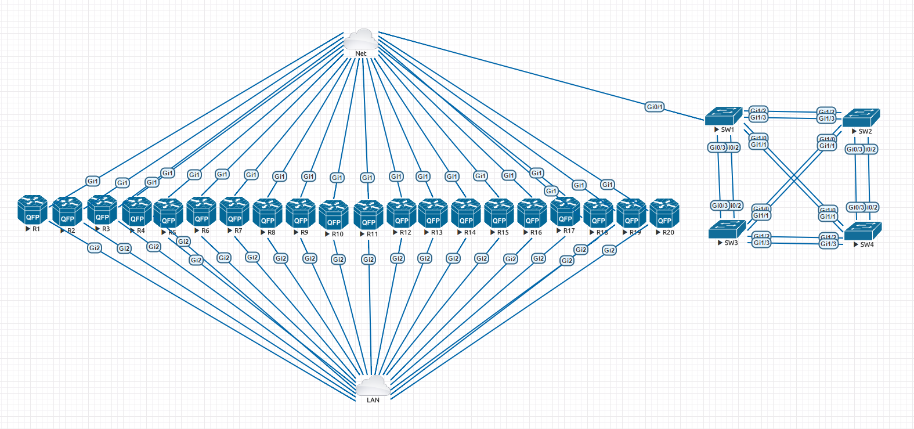

# ccie-lab-tools
Some tools for management of ccie lab environment. I used this for CCIE R&S v5 labs with INEs hardware topology and CSR1000v.

## Comments and usage instructions

#### base-config.txt
All CSR:s needs at least to have hostname, username, mgmt ip and ssh enabled. This can be deployed manually the first time or with DHCP reservations and IOS autoinstall. When running config contains a solid setup save it to bootflash, copy running bootflash:clean_config.txt. This is used by the reset scripts and survives intentional or unintentional startup config manipulation.

#### deploy-config.py
Download and put all INE initial configs on file/web server and push them with this script. This server needs to accessible from mgmt vrf on the CSR:s. The script asks for url to directory, choose the lab and provide the url, example http://10.0.0.50/INE/advanced.technology.labs/basic.bgp.routing/

Note the configs from INE needs a bit of work before they can be used. Remove "no login" from vty lines, remove ip address from Gi2, remove commands including serial number etc. Unfortunately they have no consistency so all the files needs to be checked. For instance some directories have the files named with r and some with R, everything needs to be upper-case.

#### reset-routers_fast.py  
Reset all routers without reboot. You need a locally stored base config for this on all routers, see base-config.txt.

#### reset-routers_slow.py
Reset all routers with reboot. You need a locally stored base config for this on all routers, see base-config.txt.

#### wr-all.yml
The name says it. Needs to be supplemented with an ansible hosts file.

#### send-commands.yml
Send arbitrary commands to all routers. Needs to be supplemented with an ansible hosts file.

#### auto-connect.sh
Used with provided screenrc.

### Eve-NG setup

